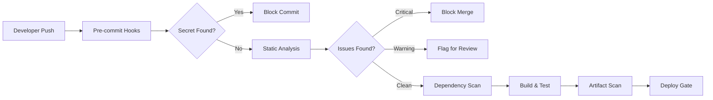

# 🔐 Security Scan & Hardening Strategy

> **[SECTION: SECURITY SCAN / HARDENING STRATEGY]**
>
> เอกสารนี้อธิบายแนวทางการป้องกันเชิงรุก (Proactive Defense) สำหรับโปรเจกต์ Border Safety Risk Checker
> โดยมุ่งเน้นแนวคิดและสถาปัตยกรรมความปลอดภัย ไม่ใช่เครื่องมือโจมตี

---

## 📋 สารบัญ

1. [Full Project Scanning Strategy](#1-full-project-scanning-strategy)
2. [Behavioral Anomaly Detection](#2-behavioral-anomaly-detection)
3. [Hardening & Vulnerability Mitigation](#3-hardening--vulnerability-mitigation)
4. [Developer Security Checklists](#4-developer-security-checklists)

---

## 1. Full Project Scanning Strategy

### 🔍 แนวคิดการสแกนทั้งโปรเจกต์

การสแกนความปลอดภัยควรครอบคลุม **ทุกไฟล์และทุกโฟลเดอร์** ในโปรเจกต์ โดยแบ่งเป็นหมวดหมู่ดังนี้:

```
┌─────────────────────────────────────────────────────────────┐
│                  SECURITY SCANNING PIPELINE                  │
├─────────────────────────────────────────────────────────────┤
│                                                             │
│  [COMMIT] ──► [PRE-MERGE CHECKS] ──► [POST-MERGE SCAN]     │
│                      │                       │              │
│                      ▼                       ▼              │
│              ┌───────────────┐      ┌───────────────┐       │
│              │ Static Scan   │      │ Full Scan     │       │
│              │ Secret Scan   │      │ Dependency    │       │
│              │ Config Check  │      │ Artifact Rev  │       │
│              └───────────────┘      └───────────────┘       │
│                                                             │
└─────────────────────────────────────────────────────────────┘
```

### 📊 ประเภทการสแกน

| ประเภท                     | เป้าหมาย                                             | ความถี่                      |
| -------------------------- | ---------------------------------------------------- | ---------------------------- |
| **Static Analysis (SAST)** | ตรวจโค้ดหา vulnerabilities, code smells, logic flaws | ทุก commit                   |
| **Dependency Scan (SCA)**  | ตรวจ package.json, lock files หา known CVEs          | ทุก PR + รายสัปดาห์          |
| **Secret Scanning**        | ค้นหา API keys, tokens, passwords ที่ hardcode       | ทุก commit (pre-commit hook) |
| **Config Scan**            | ตรวจ Dockerfile, nginx.conf, vite.config.js          | ทุก PR                       |
| **Artifact Review**        | ตรวจ build output, dist folder, sourcemaps           | ก่อน deploy                  |
| **Environment Validation** | ตรวจ env variables, production configs               | ก่อน deploy                  |

### 🔄 Pipeline อัตโนมัติ (ทุก Commit)



### 📁 ขอบเขตการสแกน

```
project/
├── backend/          ← SAST, Secret Scan, Config Check
│   ├── *.js          ← Logic analysis, injection patterns
│   ├── routes/       ← API security patterns
│   ├── middleware/   ← Auth/security middleware review
│   └── package.json  ← Dependency vulnerabilities
├── frontend/         ← SAST, XSS patterns
│   ├── src/          ← Component security
│   ├── package.json  ← Frontend dependencies
│   └── vite.config   ← Build config security
├── Dockerfile        ← Container security scan
├── .env*             ← Secret exposure check
└── *.config.js       ← Configuration validation
```

---

## 2. Behavioral Anomaly Detection

### 🚨 การตรวจจับพฤติกรรมไม่พึงประสงค์

ระบบควรมีกลไกตรวจจับและตอบสนองต่อพฤติกรรมที่บ่งชี้การโจมตีหรือการสำรวจระบบ:

### 2.1 Brute Force / Automation Probing

**รูปแบบที่ตรวจจับ:**

- Login attempts เกินกว่า threshold (เช่น >5 ครั้ง/นาที)
- Sequential credential testing patterns
- การเรียก API ซ้ำๆ ด้วยความเร็วผิดปกติ
- User-Agent patterns ที่บ่งชี้ automated tools

**แนวทางป้องกัน:**

```
┌────────────────────────────────────────────────────┐
│           ADAPTIVE RATE LIMITING                   │
├────────────────────────────────────────────────────┤
│                                                    │
│  Normal User:     100 req/min  →  ✓ Allow         │
│  Suspicious:       50 req/min  →  ⚠ Captcha       │
│  Attack Pattern:   10 req/min  →  🛑 Temp Block   │
│  Persistent:        0 req      →  🔒 IP Blacklist │
│                                                    │
└────────────────────────────────────────────────────┘
```

### 2.2 Enumeration Detection

**รูปแบบที่ตรวจจับ:**

- Sequential user ID probing (`/user/1`, `/user/2`, ...)
- Directory traversal attempts (`../`, `%2e%2e/`)
- Parameter fuzzing patterns
- Error message harvesting

**แนวทางป้องกัน:**

- ใช้ UUID แทน sequential IDs
- Normalize error responses (ไม่เปิดเผยว่ามี user หรือไม่)
- Log และ alert เมื่อพบ pattern ที่น่าสงสัย

### 2.3 Network Tampering / DevTools Manipulation

**รูปแบบที่ตรวจจับ:**

- Request replay attacks
- Token/session manipulation
- Parameter tampering (เช่น เปลี่ยน user_id ใน request)
- Timing attacks

**แนวทางป้องกัน:**

- Request signing / HMAC validation
- Timestamp validation (reject stale requests)
- Server-side validation ทุก field (ไม่ trust client)
- Anti-tampering tokens

### 2.4 Fingerprinting / Behavioral Exploration

**รูปแบบที่ตรวจจับ:**

- การเรียก endpoints ที่ไม่มีอยู่อย่างเป็นระบบ
- การทดสอบ HTTP methods ต่างๆ
- การสำรวจ response headers
- การทดสอบ CORS policies

**แนวทางป้องกัน:**

- ซ่อน server fingerprints (ลบ X-Powered-By, Server headers)
- Rate limit 404 responses
- Honeypot endpoints เพื่อตรวจจับ attackers

---

## 3. Hardening & Vulnerability Mitigation

### 🔒 Session Integrity Enforcement

```
┌─────────────────────────────────────────────────────────────┐
│                   SESSION SECURITY MODEL                    │
├─────────────────────────────────────────────────────────────┤
│                                                             │
│  ┌──────────┐    ┌──────────────┐    ┌──────────────┐       │
│  │ Login    │ ─► │ Generate     │ ─► │ Bind to:     │       │
│  │ Success  │    │ Secure Token │    │ - IP (opt)   │       │
│  └──────────┘    └──────────────┘    │ - User Agent │       │
│                                       │ - Device ID  │       │
│                                       └──────────────┘       │
│                                              │               │
│                                              ▼               │
│  ┌─────────────────────────────────────────────────────┐    │
│  │  On Each Request:                                   │    │
│  │  ✓ Validate token signature                         │    │
│  │  ✓ Check expiry (short-lived + refresh)             │    │
│  │  ✓ Verify binding matches                           │    │
│  │  ✓ Rotate token on sensitive actions                │    │
│  └─────────────────────────────────────────────────────┘    │
│                                                             │
└─────────────────────────────────────────────────────────────┘
```

### 🎚️ Adaptive Throttling

การ throttle ควรปรับตามพฤติกรรม ไม่ใช่ rate คงที่:

| Risk Score         | Rate Limit  | Additional Measures |
| ------------------ | ----------- | ------------------- |
| 0-20 (Normal)      | 100 req/min | None                |
| 21-50 (Elevated)   | 50 req/min  | Logging increased   |
| 51-80 (Suspicious) | 10 req/min  | Captcha required    |
| 81-100 (Attack)    | 0           | Block + Alert team  |

### 📊 Anomaly Scoring

ทุก request ควรได้รับ anomaly score ที่คำนวณจาก:

```
AnomalyScore = Σ(weights × indicators)

Indicators:
- Request frequency deviation         (weight: 0.3)
- Geographic impossibility            (weight: 0.2)
- User-Agent anomaly                  (weight: 0.1)
- Payload pattern matching            (weight: 0.2)
- Historical behavior deviation       (weight: 0.2)
```

### 🛡️ Zero-Trust Authentication Logic

**หลักการ: Never Trust, Always Verify**

```
┌────────────────────────────────────────────────────────────────┐
│                    ZERO-TRUST FLOW                              │
├────────────────────────────────────────────────────────────────┤
│                                                                │
│  ┌─────────┐    ┌──────────────┐    ┌──────────────────────┐   │
│  │ Request │ ─► │ Authenticate │ ─► │ Authorize per action │   │
│  └─────────┘    │ (Who?)       │    │ (What can they do?)  │   │
│                 └──────────────┘    └──────────────────────┘   │
│                        │                      │                 │
│                        ▼                      ▼                 │
│                 ┌──────────────┐    ┌──────────────────────┐   │
│                 │ Validate     │    │ Check:               │   │
│                 │ Context      │    │ - Resource ownership │   │
│                 │ (Where/When) │    │ - Role permissions   │   │
│                 └──────────────┘    │ - Action allowed     │   │
│                                     └──────────────────────┘   │
│                                                                │
│  ✗ Default Deny: ปฏิเสธทุกอย่างที่ไม่ได้รับอนุญาตชัดเจน         │
│  ✓ Least Privilege: ให้สิทธิ์น้อยที่สุดที่จำเป็น                   │
│  ✓ Continuous Validation: ตรวจสอบตลอดเวลา ไม่ใช่แค่ตอน login      │
│                                                                │
└────────────────────────────────────────────────────────────────┘
```

### ⚙️ Secure Configuration Hygiene

**Must-have configurations:**

```yaml
# Production Configuration Checklist
environment:
  NODE_ENV: production
  DEBUG: false

cors:
  origin: [explicit-domains-only]
  credentials: true
  methods: [GET, POST] # Limit to required only

headers:
  X-Frame-Options: DENY
  X-Content-Type-Options: nosniff
  X-XSS-Protection: "1; mode=block"
  Strict-Transport-Security: "max-age=31536000; includeSubDomains"
  Content-Security-Policy: [strict-policy]
  Referrer-Policy: strict-origin-when-cross-origin

cookies:
  httpOnly: true
  secure: true
  sameSite: strict

logging:
  level: warn # ไม่ log sensitive data
  sanitize: true
```

### 📝 Centralized Logging & Monitoring

```
┌─────────────────────────────────────────────────────────────────┐
│                    LOGGING ARCHITECTURE                          │
├─────────────────────────────────────────────────────────────────┤
│                                                                 │
│   ┌───────────┐   ┌───────────┐   ┌───────────┐                │
│   │ Frontend  │   │ Backend   │   │ Database  │                │
│   │ Errors    │   │ Access    │   │ Queries   │                │
│   └─────┬─────┘   └─────┬─────┘   └─────┬─────┘                │
│         │               │               │                       │
│         └───────────────┼───────────────┘                       │
│                         ▼                                        │
│              ┌──────────────────┐                               │
│              │ Log Aggregator   │                               │
│              │ (with PII mask)  │                               │
│              └────────┬─────────┘                               │
│                       │                                          │
│         ┌─────────────┼─────────────┐                           │
│         ▼             ▼             ▼                           │
│   ┌──────────┐  ┌──────────┐  ┌──────────┐                      │
│   │ Real-time│  │ Dashboards│ │ Alerts   │                      │
│   │ Stream   │  │ & Reports │  │ (Slack/  │                      │
│   │ Analysis │  │           │  │ PagerDuty)│                     │
│   └──────────┘  └──────────┘  └──────────┘                      │
│                                                                 │
└─────────────────────────────────────────────────────────────────┘
```

**Log Categories for Security:**

- Authentication events (success/failure)
- Authorization failures
- Input validation failures
- Rate limit hits
- Anomaly detections
- Configuration changes

### 🚦 CI Pipeline Enforcement

```
┌─────────────────────────────────────────────────────────────────┐
│              SECURITY GATES IN CI/CD PIPELINE                    │
├─────────────────────────────────────────────────────────────────┤
│                                                                 │
│  [Code Push]                                                    │
│      │                                                          │
│      ▼                                                          │
│  ┌─────────────────────────────────────────────────────────┐    │
│  │ GATE 1: Pre-commit                                      │    │
│  │ ✓ Secret scan (gitleaks/truffleHog concept)            │    │
│  │ ✓ Lint (eslint-plugin-security patterns)               │    │
│  └─────────────────────────────────────────────────────────┘    │
│      │                                                          │
│      ▼                                                          │
│  ┌─────────────────────────────────────────────────────────┐    │
│  │ GATE 2: PR Review                                       │    │
│  │ ✓ SAST scan (SonarQube/Semgrep concept)                │    │
│  │ ✓ Dependency check (npm audit/Snyk concept)            │    │
│  │ ✓ Unit tests with security cases                       │    │
│  └─────────────────────────────────────────────────────────┘    │
│      │                                                          │
│      ▼                                                          │
│  ┌─────────────────────────────────────────────────────────┐    │
│  │ GATE 3: Pre-merge                                       │    │
│  │ ✓ All tests pass                                        │    │
│  │ ✓ No critical/high vulnerabilities                      │    │
│  │ ✓ Code review approved                                  │    │
│  │ ✓ Security checklist completed                          │    │
│  └─────────────────────────────────────────────────────────┘    │
│      │                                                          │
│      ▼                                                          │
│  ┌─────────────────────────────────────────────────────────┐    │
│  │ GATE 4: Pre-deploy                                      │    │
│  │ ✓ Build artifact scan                                   │    │
│  │ ✓ Container image scan (if applicable)                  │    │
│  │ ✓ Environment config validation                         │    │
│  └─────────────────────────────────────────────────────────┘    │
│                                                                 │
└─────────────────────────────────────────────────────────────────┘
```

---

## 4. Developer Security Checklists

### ✅ Secure Coding Checklist

เช็คลิสต์สำหรับนักพัฒนาก่อน commit:

#### 🔐 Authentication & Authorization

- [ ] ใช้ bcrypt/argon2 สำหรับ hash passwords (cost factor ≥10)
- [ ] Implement session expiry (short-lived tokens)
- [ ] ตรวจสอบสิทธิ์ทุก protected endpoint
- [ ] ไม่ hardcode credentials หรือ secrets
- [ ] ใช้ secure random สำหรับ token generation

#### 📥 Input Handling

- [ ] Validate ทุก input จาก client (type, length, format)
- [ ] Sanitize ก่อน output (HTML encoding)
- [ ] ใช้ parameterized queries เสมอ
- [ ] Reject unexpected fields (whitelist approach)
- [ ] Limit payload size

#### 🌐 API Security

- [ ] ใช้ HTTPS เท่านั้น
- [ ] Implement rate limiting
- [ ] Return consistent error messages (ไม่เปิดเผย internal info)
- [ ] ตั้งค่า CORS อย่างถูกต้อง (ไม่ใช้ `*` ใน production)
- [ ] Validate Content-Type headers

#### 🍪 Session & Cookies

- [ ] ใช้ HttpOnly, Secure, SameSite flags
- [ ] Regenerate session ID หลัง login
- [ ] Implement proper logout (invalidate server-side)
- [ ] ไม่เก็บ sensitive data ใน localStorage

#### 📤 Output & Logging

- [ ] ไม่ log sensitive data (passwords, tokens, PII)
- [ ] Mask sensitive fields ใน logs
- [ ] Return generic error messages to client
- [ ] Log security events ด้วย adequate detail

---

### ✅ CI/CD Security Steps

```markdown
## Pre-commit

1. [ ] Run secret scanner on staged files
2. [ ] Run linter with security rules
3. [ ] Verify no debug code committed

## Pull Request

4. [ ] SAST scan passes (no critical issues)
5. [ ] Dependency scan passes (no high CVEs)
6. [ ] All tests pass including security tests
7. [ ] Code reviewed by security-aware dev

## Pre-merge

8. [ ] Branch is up-to-date with main
9. [ ] All CI checks green
10. [ ] Security checklist completed in PR description

## Pre-deploy

11. [ ] Build artifacts scanned
12. [ ] Environment variables validated
13. [ ] Rollback plan documented
14. [ ] Monitoring/alerting configured
```

---

### ✅ Security Scanning Tools (by Category)

| หมวดหมู่               | วัตถุประสงค์                  | ตัวอย่าง Tools                              |
| ---------------------- | ----------------------------- | ------------------------------------------- |
| **SAST**               | Static code analysis          | SonarQube, Semgrep, ESLint security plugins |
| **SCA**                | Dependency vulnerabilities    | npm audit, Snyk, Dependabot                 |
| **Secret Scanning**    | Hardcoded secrets             | gitleaks, truffleHog, git-secrets           |
| **Container Scanning** | Docker image vulnerabilities  | Trivy, Clair, Anchore                       |
| **DAST**               | Runtime vulnerability testing | OWASP ZAP (authorized testing only)         |
| **Config Scanning**    | Misconfigurations             | Checkov, tfsec, hadolint                    |
| **License Scanning**   | OSS license compliance        | FOSSA, WhiteSource                          |

---

### ✅ Secure Configuration Must-Have List

```markdown
## Server Configuration

- [ ] TLS 1.2+ only (disable older versions)
- [ ] Strong cipher suites
- [ ] HSTS enabled with long max-age
- [ ] Certificate pinning (mobile apps)

## Application Configuration

- [ ] Debug mode disabled in production
- [ ] Stack traces hidden from users
- [ ] Secure default values
- [ ] Environment-specific configs

## Database Configuration

- [ ] Least privilege DB user
- [ ] Encrypted connections
- [ ] No default passwords
- [ ] Regular backups encrypted

## Logging Configuration

- [ ] Centralized logging
- [ ] PII masking enabled
- [ ] Log retention policy set
- [ ] Access logs for audit

## Network Configuration

- [ ] Firewall rules (deny default)
- [ ] Internal services not exposed
- [ ] Rate limiting at edge
- [ ] DDoS protection
```

---

### ✅ Remediation Prioritization Scheme

การจัดลำดับความสำคัญในการแก้ไข vulnerabilities:

| Priority          | Severity     | Response Time | Criteria                                             |
| ----------------- | ------------ | ------------- | ---------------------------------------------------- |
| **P0 - Critical** | CVSS ≥9.0    | 24 hours      | Remote code execution, auth bypass, data breach risk |
| **P1 - High**     | CVSS 7.0-8.9 | 7 days        | Privilege escalation, significant data exposure      |
| **P2 - Medium**   | CVSS 4.0-6.9 | 30 days       | Limited impact, requires user interaction            |
| **P3 - Low**      | CVSS <4.0    | Next release  | Minor issues, defense in depth                       |
| **P4 - Info**     | N/A          | Best effort   | Code quality, future-proofing                        |

**Escalation Matrix:**

```
P0 (Critical)
├── Immediately notify security lead
├── Create incident ticket
├── Begin remediation
└── Post-mortem required

P1 (High)
├── Notify dev lead
├── Schedule for next sprint
└── Track in security backlog

P2-P3 (Medium/Low)
├── Add to backlog
├── Address in regular cycle
└── Review quarterly
```

---

## 📌 Summary

เอกสารนี้ครอบคลุมแนวทางการป้องกันด้านความปลอดภัยในมุมมองของ DevSecOps:

1. **Full Project Scanning** - สแกนทุกไฟล์ตั้งแต่ commit จนถึง deploy
2. **Behavioral Detection** - ตรวจจับพฤติกรรมผิดปกติแบบ proactive
3. **Hardening Strategy** - ปิดช่องโหว่และเสริมความแข็งแกร่ง
4. **Developer Checklists** - รายการตรวจสอบสำหรับทีมพัฒนา

> ⚠️ **หมายเหตุ**: เอกสารนี้มีวัตถุประสงค์เพื่อการป้องกันเท่านั้น ไม่มีข้อมูลที่ใช้เพื่อโจมตีระบบ

---

_Document Version: 1.0 | Last Updated: December 2024_
